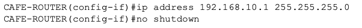
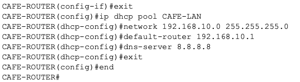
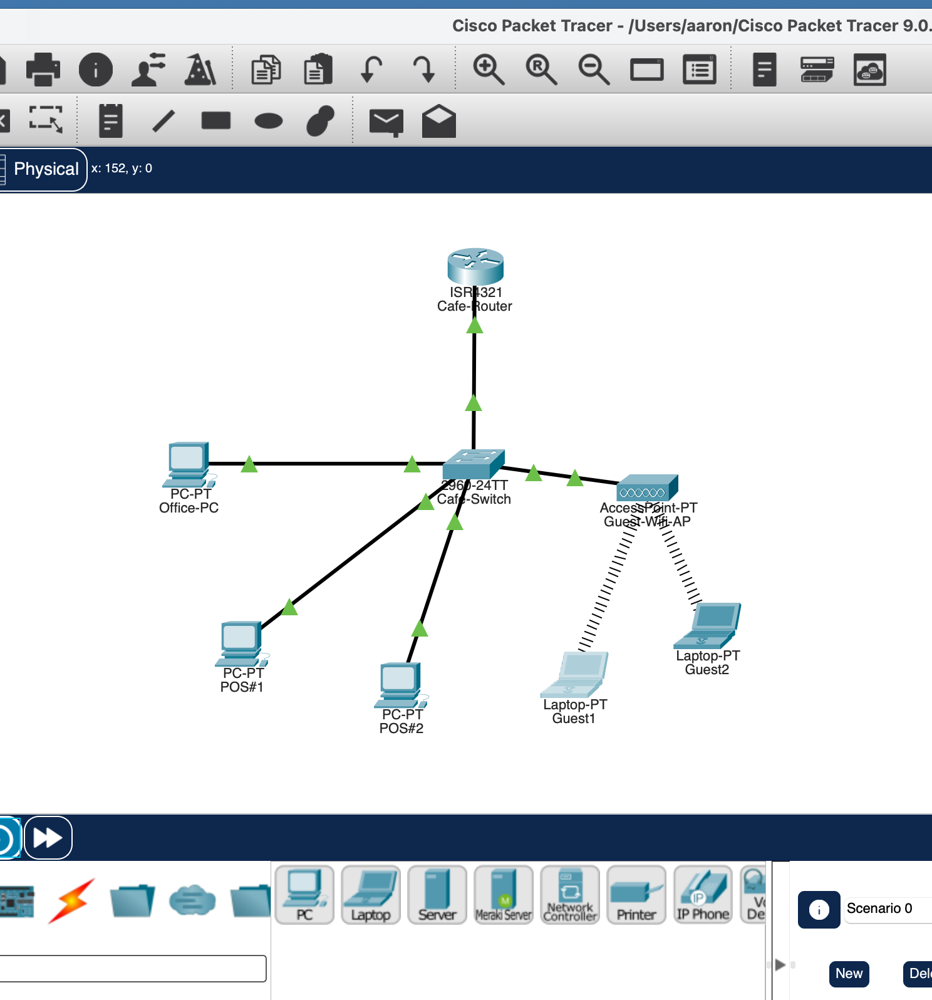
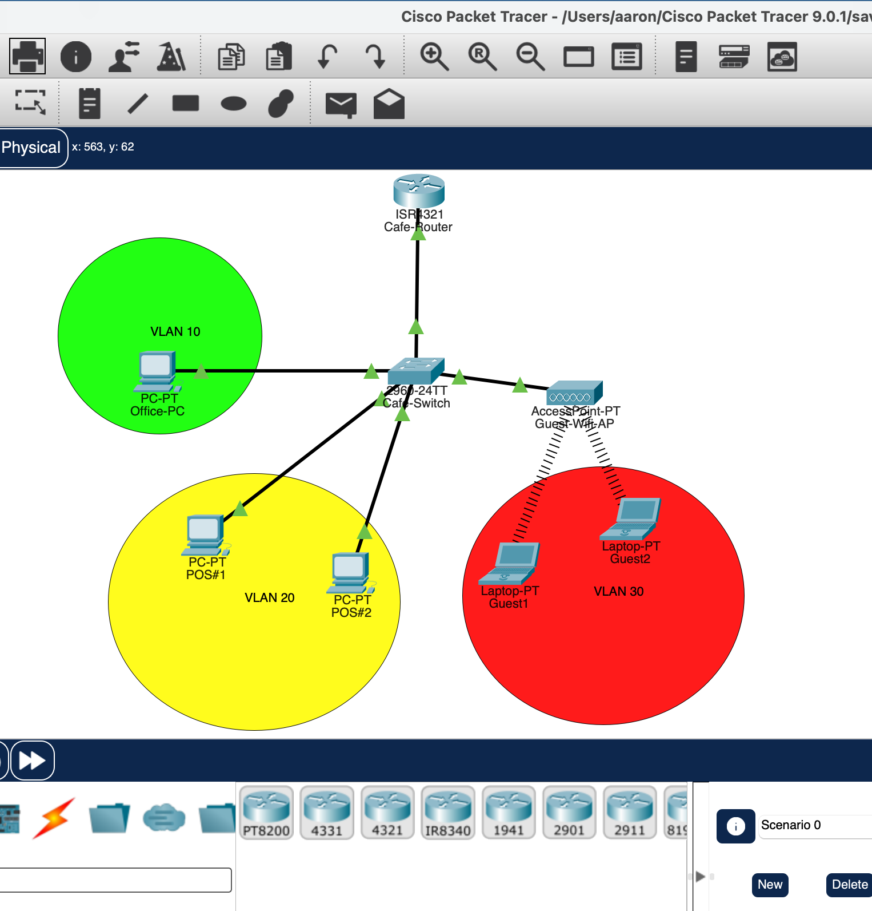
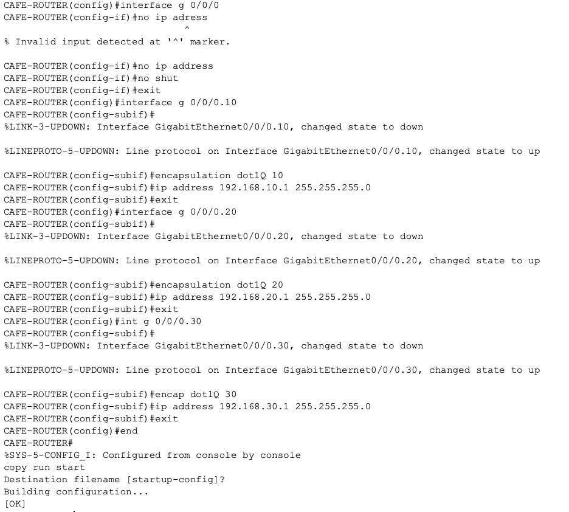
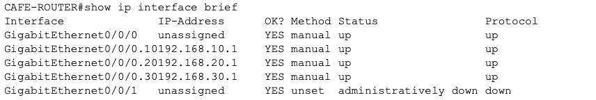
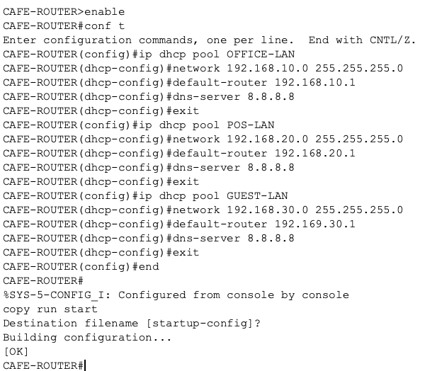
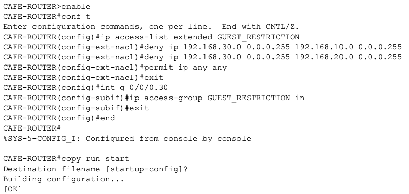
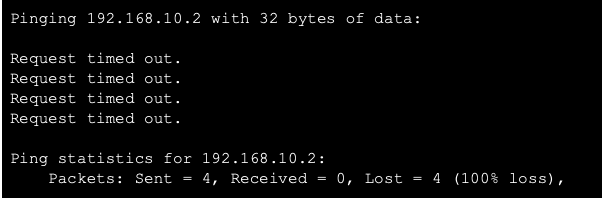
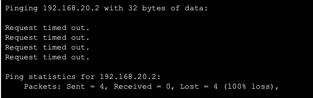

# Cafe Lab

This Packet Tracer lab demonstrates a small cafe network that begins as a flat, single-subnet design and evolves into a segmented VLAN architecture with DHCP services, router-on-a-stick routing, and an extended ACL policy for guest isolation.

## Lab Files

- `Cafe_Lab.pkt` — Packet Tracer project file
- `Screenshots/` — images documenting the lab progression and final verification

## Objective

The goal of this lab was to:

- build a flat network with a single subnet, DHCP scope, and both wired and wireless connectivity
- transition to VLAN segmentation using a switch and router-on-a-stick configuration
- create per-VLAN DHCP pools on the router subinterfaces
- restrict guest clients from communicating with Office and POS networks using an extended ACL
- verify success with end-to-end pings

## Lab Workflow

### 1. Flat Network Setup

The first phase of the lab created a simple cafe network using a single subnet and one DHCP scope. Devices were connected to the same broadcast domain so the environment functioned as a basic local LAN with both wired and wireless access.

This stage established the baseline connectivity and confirmed that devices could obtain addressing and communicate before segmentation.

### 2. VLAN Segmentation and Router-on-a-Stick

The second phase introduced VLANs to separate traffic by function:

- VLAN 10 = Office
- VLAN 20 = POS
- VLAN 30 = Guest

A switch was configured to support VLANs and a router connection was changed to a trunk link using 802.1Q. Each VLAN was mapped to a subinterface on the router, creating the classic router-on-a-stick design.

This allowed inter-VLAN routing while keeping the subnets logically separated.

### 3. Per-VLAN DHCP Pools

Each VLAN received its own DHCP pool on the router subinterfaces. This ensured devices on each segment received an appropriate IP address, default gateway, and DNS configuration based on their network.

The guest subnet was configured to provide addresses in the guest VLAN range, while Office and POS devices received addresses from their respective VLAN pools.

### 4. Extended ACL for Guest Isolation

An extended ACL was created to restrict communication from the Guest VLAN while allowing business traffic for Office and POS devices.

The policy was designed to:

- allow Office-to-Office and Office-to-POS communication as needed
- allow POS traffic required for business operations
- deny Guest traffic from reaching Office and POS networks
- preserve guest internet or general access if required by the design

This created a security boundary where guest Wi-Fi users could not access internal business systems.

### 5. Verification with End-to-End Pings

Connectivity checks were performed to validate the final configuration:

- Office devices could communicate with other allowed business devices
- POS devices remained reachable for required network services
- Guest devices were blocked from reaching Office and POS networks
- successful ping tests confirmed the expected ACL behavior and routing configuration

## Device Summary

| Device | VLAN / Role | Notes |
| --- | --- | --- |
| Office PC | VLAN 10 | Internal office client |
| POS #1 | VLAN 20 | Point-of-sale terminal |
| POS #2 | VLAN 20 | Point-of-sale terminal |
| Guest Device 1 | VLAN 30 | Guest Wi-Fi client |
| Guest Device 2 | VLAN 30 | Guest Wi-Fi client |
| Cafe-Switch | Layer 2 switch | VLAN segmentation and trunking |
| Cafe-Router | Router | Inter-VLAN routing and DHCP services |
| Access Point | Wireless access | Guest connectivity |

## Network Design

The final topology uses:

- a trunk link between the switch and router
- subinterfaces on the router for VLAN 10, VLAN 20, and VLAN 30
- DHCP pools configured per VLAN
- ACL rules to block guest access to business networks

This design reflects a realistic cafe environment where guest access is separated from internal business operations.

## Screenshots and Lab Evidence

### Step 1: Initial flat network and DHCP baseline

This stage shows the original single-subnet design with a single DHCP scope and both wired and wireless connectivity.

### Step 2: Physical topology and VLAN segmentation

The network was then reorganized into separate Office, POS, and Guest segments using VLAN-aware design.

### Step 3: Router-on-a-stick and dot1Q subinterfaces

The router was configured for inter-VLAN routing using 802.1Q trunking and subinterfaces for each VLAN.

### Step 4: Per-VLAN DHCP pools

Each VLAN received its own DHCP pool on the corresponding router subinterface.

### Step 5: Guest ACL restriction

An extended ACL was created to block Guest VLAN communication with the Office and POS networks while allowing business traffic as needed.

### Step 6: Verification with end-to-end pings

The final validation confirmed the ACL behavior.

## What I Learned

One of the most important takeaways from this lab was realizing that a Layer 3 switch could have handled inter-VLAN routing on a single device. However, I chose to use a router-on-a-stick design instead because it fit the needs of this network more effectively.

The cafe network is small and does not generate a large amount of traffic, so the performance bottleneck of routing through a single router interface was not a significant concern. In this case, the dedicated router and Layer 2 switch offered a cleaner separation of responsibilities, easier troubleshooting, and a more secure design. By keeping the routing function on the router and the switching function on the switch, the network is easier to understand, maintain, and scale in the future if needed.

I also learned that a Layer 3 switch can be a great option in larger or more traffic-heavy environments, but for a small deployment like this one, the cost and security benefits of a dedicated router were more practical. This approach gave me a strong understanding of how VLANs, trunking, DHCP, and ACLs work together in a realistic network design.

## Key Takeaways

This lab illustrates several foundational networking concepts:

- flat LAN design and DHCP basics
- VLAN segmentation for network isolation
- router-on-a-stick architecture
- per-VLAN DHCP configuration
- access control with extended ACLs
- verification through ping testing and connectivity validation

## Conclusion

The lab was successfully completed by moving from a simple flat network to a secure segmented cafe network. The end result provides proper service isolation, DHCP assignment by VLAN, and controlled guest access while allowing business traffic between the Office and POS segments.
